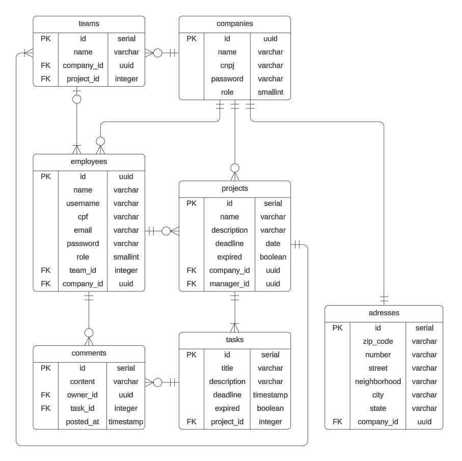

## Office RestAPI
<p align = "justify">
The Office API was developed to enable companies to manage their own business better. In the application, companies are able to register employees and configurate projects with specialized teams. Managers can set new tasks for their led projects with description of what they have to do and deadlines to achieve. At the same time, employees must organize their objectives by observing deadlines and commenting on tasks for the rest of the team.
</p>

### Technologies 📱

- Java Language 17
- Spring Boot (Web, JPA, Security)
- Database with Flyway Migrations
- PostgreSQL Relational Database
- Tests with JUnit 5 and Mockito
- OAuth2 Resource Server
- JWT Token and Lombok
- Spring Validation

### Deploy ☁️
<p align = "justify">
Both the RESTful API and PostgreSQL Database was deployed using the Render services and you can already use it. Make your requests in your own HTTP CLient, like Postman for example, through the following link (https://officeapi-deploy.onrender.com). I left below a Postman collection with all the API requests, so you can test easier!

The Download:

[](https://drive.google.com/file/d/1vT6ms0iXogV3fY9pUPU_ycZI98H_km0o/view?usp=sharing)

But even though the API is already deployed and hosted on Render, you steel choose to run the application on your own computer, don't worry about it, here are some instructions for you to make everything runs okay.
</p>

### Configuration ⚙️
Before you start, you need this installed:
- HTTP Client [Download Postman](https://www.postman.com/downloads/)
- Code Editor IDE [Download Intelij](https://www.jetbrains.com/idea/download/?section=windows)
- Cryptography [Download OpenSSL](https://sourceforge.net/projects/openssl/)
- Versioning Software [Downlaod GIT](https://git-scm.com/downloads)
- Java Language [Download Java SDK](https://www.oracle.com/br/java/technologies/downloads/)
- Dependency Manager [Download Maven](https://maven.apache.org/download.cgi)
- PostgreSQL Database [Download Postgre](https://www.postgresql.org/download/)

Define your system environment variables:

- PUBLIC_KEY
- PRIVATE_KEY
```bash
# generate private key:
openssl genpkey -algorithm RSA -out private_key.pem -pkeyopt rsa_keygen_bits:2048
# generate public key:
openssl rsa -pubout -in private_key.pem -out public_key.pem

# copy the content into the variables
```
- DATABASE_URL
- DATABASE_USERNAME
- DATABASE_PASSWORD
- Maven, OpenSSL and GIT

After it, open command prompt and follow:
```bash
# clone the repository
git clone https://github.com/pedroxcav/OfficeAPI.git

# select the project folder
cd OfficeAPI

# test the application
mvn test

# run the application
mvn exec:java
# press (ctrl + c) to stop
```
### Documentation 📋
Information of endpoints and planning the API
#### Endpoints

<details>
  <summary>Comment Controller</summary>

    1. POST /comments/{task_id}
    # creates a new comment

    2. PUT /comments/{id}
    # updates a comment

    3. DELETE /comments/{id}
    # deletes a comment
    
    4. GET /comments/{id}
    # get a specific comment
    
    5. GET /comments
    # get all its comments
</details>
<details>
  <summary>Company Controller</summary>
  
    1. POST /companies
    # registers a new company
    
    2. POST /companies/login
    # authenticates a company
    
    3. PUT /companies
    # updates a company

    4. DELETE /company
    # deletes the own company

    5. GET /company
    # return the own company
</details>
<details>
  <summary>Employee Controller</summary>

    1. POST /employees/login
    # authenticates a employee
    
    2. POST /employees
    registers a new employee

    3. PUT /employees
    # updates a employee

    4. GET /employees
    # company requires all employees

    5. GET /employees/me
    # employee requires own profile
</details>
<details>
  <summary>Address Controller</summary>

    1. UPDATE /adresses
    # updates its address

    2. GET /adresses
    # company requires its address
</details>
<details>
  <summary>Project Controller</summary>

    1. POST /projects
    # creates a new project

    2. PUT /projects/{id}
    # updates a specific project

    3. DELETE /projects/{id}
    # deletes a specific project

    4. GET /projects
    # get all company's project

    5. GET /projects/{id}
    # get a specific project
</details>
<details>
  <summary>Team Controller</summary>

    1. POST /teams
    # creates a new team

    2. PUT /teams/{id}
    # updates a specific team

    3. DELETE /teams/{id}
    # deletes a specific team

    4. GET /teams
    # get all company's teams

    5. GET /teams/project
    # get the project's teams
</details>
<details>
  <summary>Task Controller</summary>

    1. POST /tasks
    # creates a new task

    2. PUT /tasks/{id}
    # updates a task

    3. DELETE /tasks/{id}
    # deletes a task
    
    4. GET /tasks
    # get all its tasks
    
    5. GET /tasks/{id}
    # get a specifc task
</details>

#### Diagrams
<details>
  <summary>ER Diagram</summary>
  <br>
  
  
</details>
<details>
  <summary>Class Diagram</summary>
  <br>
  
  
</details>

### Autor
Project developed by Pedro Cavalcanti.

Doubts or suggestions, message me here: 

[](https://www.linkedin.com/in/pedroxcav/)
[](https://www.instagram.com/pedroxcav/)
[](mailto:pedroxcav@gmail.com)
